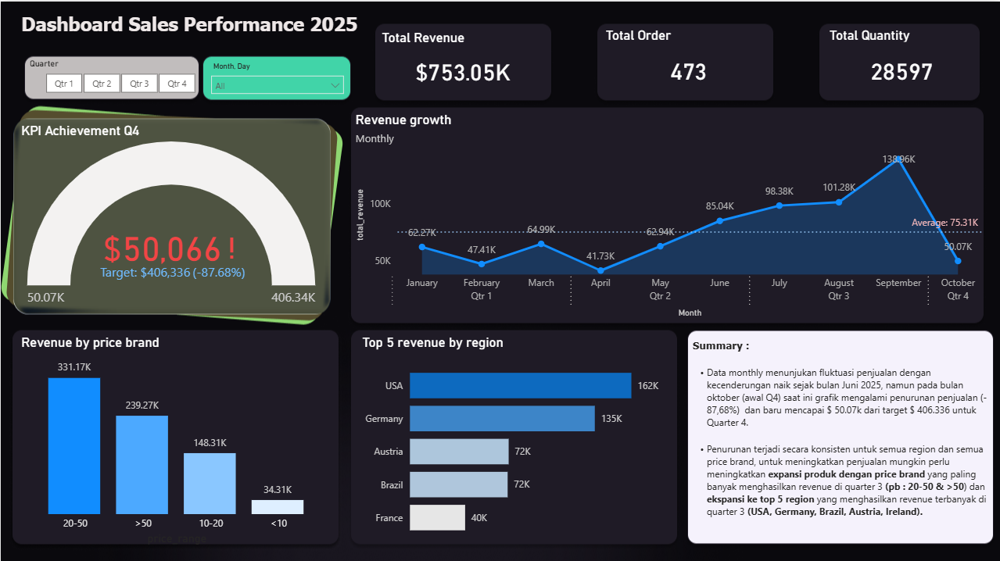
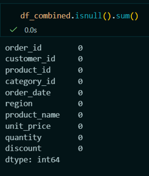
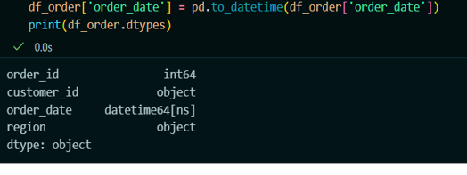
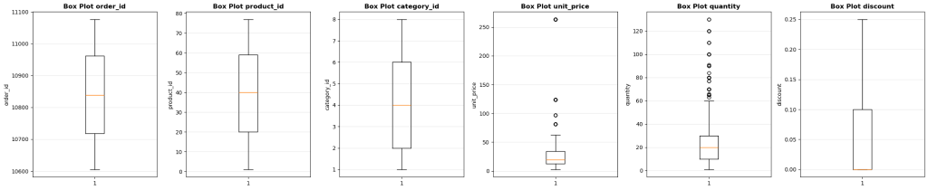
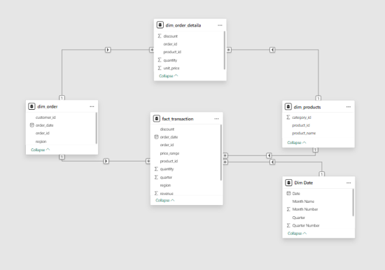

# Dashboard Sales - Monitoring KPI 2025


# Latar Belakang
Keadaan perusahaan saat ini mengalami pertumbuhan penjualan yang stabil pada setiap quarter dan ada peningkatan pada Q3, perusahaan ingin mengendalikan kondisi pada Q4 agar tidak mengalami penurunan dan ingin meningkatkan pertumbuhan penjualan sebesar 20% dari Q3.

# Tujuan 
Meningkat pertumbuhuan penjualan Quarter 4 sebesar 20% dari Quarter 3 

# Pengumpulan Data
Sumber dataset database BI (postgresql) :
1. Order

   📌 Karakteristik data :
   - Data terdiri dari 473 baris  dan 4 kolom (order_id,customer_id, order_date, region)
   - Type data : 
      Int64 (bigint) = order_id,
      Object = customer_id, order_date, region


3. Order Details

    📌 Karakteristik data :
   - Data terdiri dari 1215 baris dan 5 kolom (order_id, product_id, unit_price, quantity, discount)
   - Type data : 
      Int64 (bigint) = order_id, product_id, quantity. Float64 = unit_price dan discount


5. Products

    📌 Karakteristik data :
   - Data terdiri dari 77 baris  dan 3 kolom (product_id, category_id, product_name)
   - Type data : 
      Int64 (bigint) = product_id dan category_id
   
# Data Understanding
1. Order_id
    - Order ID disimpan dalam bentuk int64
    - Order ID di tabel Order mewakili 1 record data sehingga dapat dipastikan tidak ada duplikat transaksi.
    - Satu order id di tabel Order Details mewakili 1 baris produk dalam order, sehingga order id dapat duplikat dan tidak dapat disimpan di satu baris.
    - Tidak ditemukan adanya data kosong pada keduanya.

2. Customer_id
    - Customer  ID disimpan dalam bentuk object (string)
    - Satu customer ID dapat muncul pada banyak record order, yang menunjukkan bahwa satu customer dapat melakukan lebih dari satu transaksi.
    - Tidak ditemukan adanya data kosong pada Customer ID
    - Customer ID tidak memiliki hubungan langsung dengan nilai penjualan, namun digunakan sebagai jembatan untuk menghitung berbagai metrik bisnis seperti jumlah transaksi per customer, repeat order, customer lifetime value, dan segmentasi pelanggan.

3. Order_date
    - Order Date disimpan dalam bentuk object (string) yang seharusnya disimpan dalam bentuk date.
    - Satu record data merepresentasikan satu transaksi pada satu tanggal tertentu, sehingga satu tanggal dapat memiliki banyak transaksi.
    - Tidak ditemukan adanya data kosong
    - Order date tidak memiliki hubungan secara langsung dengan penjualan dan performa bisnis. Tapi digunakan sebagai jembatan perhitungan metrik penjualan dan performa bisnis.

4. Region
    - Region disimpan dalam bentuk object (string) yang merepresentasikan wilayah geografis transaksi.
    - Satu region dapat muncul pada banyak record transaksi, yang menunjukkan bahwa satu wilayah memiliki banyak transaksi.
    - Tidak ditemukan adanya data kosong pada kolom region.
    - Region memiliki hubungan langsung dengan performa bisnis karena digunakan untuk analisis penjualan per wilayah,
    - kontribusi revenue per region, dan evaluasi performa cabang atau area penjualan.

5. Produst_id
    - Product ID disimpan dalam bentuk integer yang merepresentasikan identitas unik setiap produk.
    - Satu product ID dapat muncul pada banyak record transaksi, yang menunjukkan bahwa satu produk dapat terjual berkali-kali.
    - Tidak ditemukan adanya data kosong pada kolom product ID.
    - Produk ID tidak memiliki hubungan secara langsung dengan penjualan dan performa bisnis. tapi dapat digunakan sebagai jembatan untuk menghitung berbagai metrik dalam penjualan dan performa bisnis. 

6. Quantity
    - Quantity disimpan dalam bentuk integer yang merepresentasikan jumlah unit produk yang dibeli dalam satu transaksi.
    - Satu record data merepresentasikan jumlah unit produk dalam satu transaksi.
    - Tidak ditemukan adanya data kosong pada kolom quantity.
    - Quantity memiliki hubungan langsung dengan performa bisnis karena digunakan untuk menghitung total unit terjual dan demand produk

7. Unit_price
    - Unit price disimpan dalam bentuk numerik (float) yang merepresentasikan harga satuan produk.
    - Tidak ditemukan adanya data kosong pada kolom unit price.
    - Unit price merepresentasikan harga jual per unit produk.
    - Unit price memiliki hubungan langsung dengan performa bisnis karena digunakan untuk menghitung revenue, margin, dan profitabilitas produk.

8. Discount 
    - Discount disimpan dalam bentuk numerik (float) yang merepresentasikan nilai potongan harga pada transaksi.
    - Satu transaksi dapat memiliki nilai diskon yang berbeda tergantung pada promo dan kebijakan penjualan.
    - Tidak ditemukan adanya data kosong pada kolom discount.
    - Discount merepresentasikan potongan harga yang diberikan kepada customer.
    - Discount tidak memiliki hubungan secara langsung dengan penjualan dan performa bisnis. tapi dapat digunakan sebagai
    - jembatan untuk menghitung berbagai metrik dalam penjualan dan performa bisnis. 

9. Category_id
    - Category ID disimpan dalam bentuk integer yang merepresentasikan identitas unik kategori produk.
    - Satu category ID dapat muncul pada banyak record transaksi, yang menunjukkan bahwa satu kategori memiliki banyak produk dan transaksi.
    - Tidak ditemukan adanya data kosong pada kolom category ID.
    - Category ID merepresentasikan kelompok produk berdasarkan jenis atau segmentasi.

10. Product_name
    - Product name disimpan dalam bentuk object (string) yang merepresentasikan nama produk.
    - Satu nama produk dapat muncul pada banyak record transaksi.
    - Tidak ditemukan adanya data kosong pada kolom product nameProduct name merepresentasikan identitas bisnis dari produk yang dijual.
    - Produk name tidak memiliki hubungan secara langsung dengan penjualan dan performa bisnis. tapi dapat digunakan sebagai jembatan untuk menghitung berbagai metrik dalam penjualan dan performa bisnis. 

# Validasi Data
1. Data duplikat
   
   ✔ Data order & Data products memiliki data yang unik untuk setiap identitas order dan produk yang tidak memiliki duplikat.

   ✔ Data details memiliki data duplikat, karena Satu order id di tabel Order Details mewakili 1 baris produk dalam order sehingga order id dapat duplikat dan tidak dapat disimpan di satu baris

3. Data Kosong
   
   ✔ Tidak ditemukan adanya data kosong pada saat EDA
   
   

5. Konsistensi Format
   
   ✔ Ditemukan ada 1 inconsistency data format, yaitu pada kolom Date yang terbaca sebagai string. Dilakukan konversi format dari string ke date dengan perintah pandas.to_datetime() di python
   


7. Outlier
   
   ✔ Ditemukan outlier pada data quantity dan Unit Price. Tapi sepertinya ini adalah data transaction Asli yang tidak perlu diubah. Kebanyakan data outlier pada Price dan quantity adalah harga dan jumlah terjual dari produk. Sehingga tidak dilakukan perubahan pada data.
   


# Menentukan Objek Data 
- order_id
- product_id
- order_date
- region
- unit_price
- quantity
- discount

# Kontruksi Data / modeling
1. Kolom awal :
   - order_id
   -  product_id
   -  order_date
   -  region
   -  unit_price
   -  quantity
   -  discount

2. Kolom baru :
   - year_month
   - quarter
   - price_range
   - revenue

## SQL Script
```sql 
SELECT
    o.order_id,
    o.order_date,
    TO_CHAR(o.order_date, 'YYYY-MM') AS year_month,
    EXTRACT(QUARTER FROM o.order_date) AS quarter,
    o.ship_country AS region,
    p.product_id,
    c.category_name,
    od.unit_price,
    od.quantity,
    od.discount,
    case 
		when p.unit_price < 10 then '<10'
		when p.unit_price between 10 and 20 then '10-20'
		when p.unit_price between 20 and 50 then '20-50'
		when p.unit_price > 50 then '>50'
		else 'high end'
		end as price_range,
	(od.unit_price * od.quantity * (1 - od.discount)) AS revenue
FROM orders o
LEFT JOIN order_details od ON o.order_id = od.order_id
LEFT JOIN products p ON od.product_id = p.product_id
LEFT JOIN categories c ON p.category_id = c.category_id
WHERE EXTRACT(YEAR FROM o.order_date) = 2025;
```
# Integrasi ke BI tools


# Dashboard Interactive


# Key Insight
Achievement target Q4 masih sangat jauh dari yang diharapkan.

Data monthly menunjukan fluktuasi penjualan dengan kecenderungan naik sejak bulan Juni 2025, namun pada bulan oktober (awal Q4) saat ini grafik mengalami penurunan penjualan (- 87,68%)  dan baru mencapai $ 50.07k dari target $ 406.336 untuk Quarter 4.

Penurunan terjadi secara konsisten untuk semua region dan semua price brand, untuk meningkatkan penjualan mungkin perlu meningkatkan expansi produk dengan price brand yang paling banyak menghasilkan revenue di quarter 3 (pb : 20-50 & >50) dan ekspansi ke top 5 region yang menghasilkan revenue terbanyak di quarter 3 (USA, Germany, Brazil, Austria, Ireland).  

